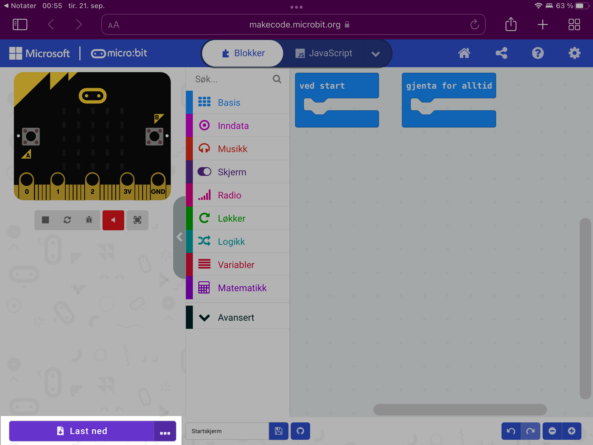
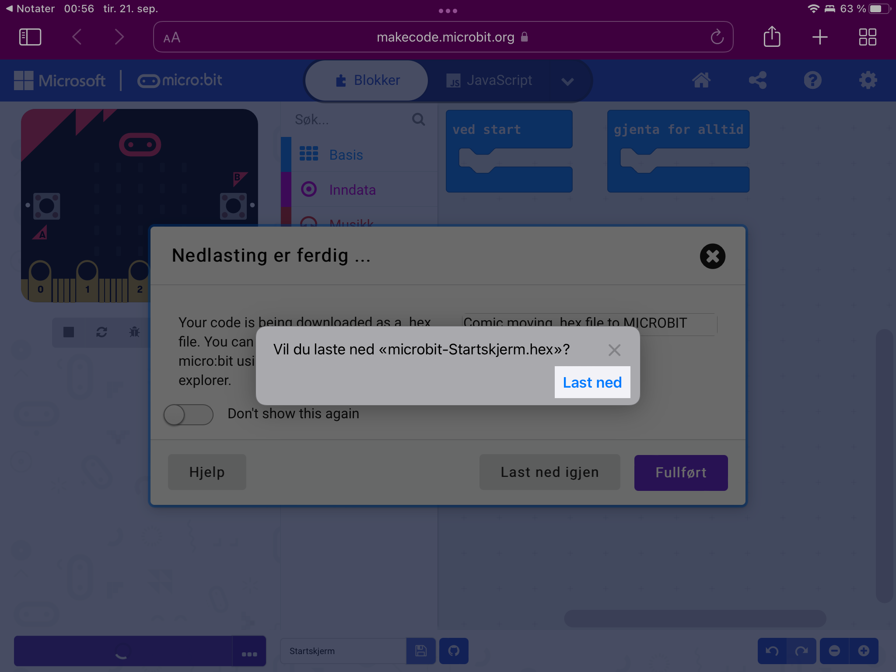
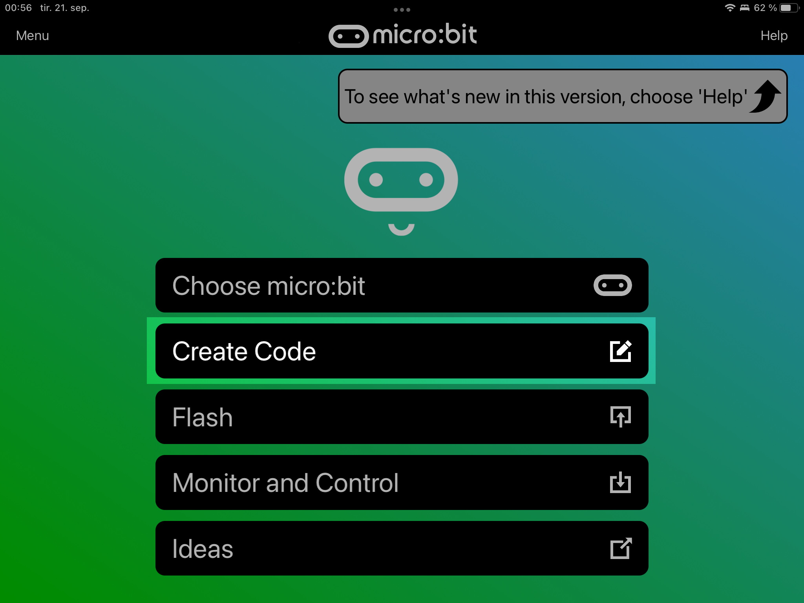
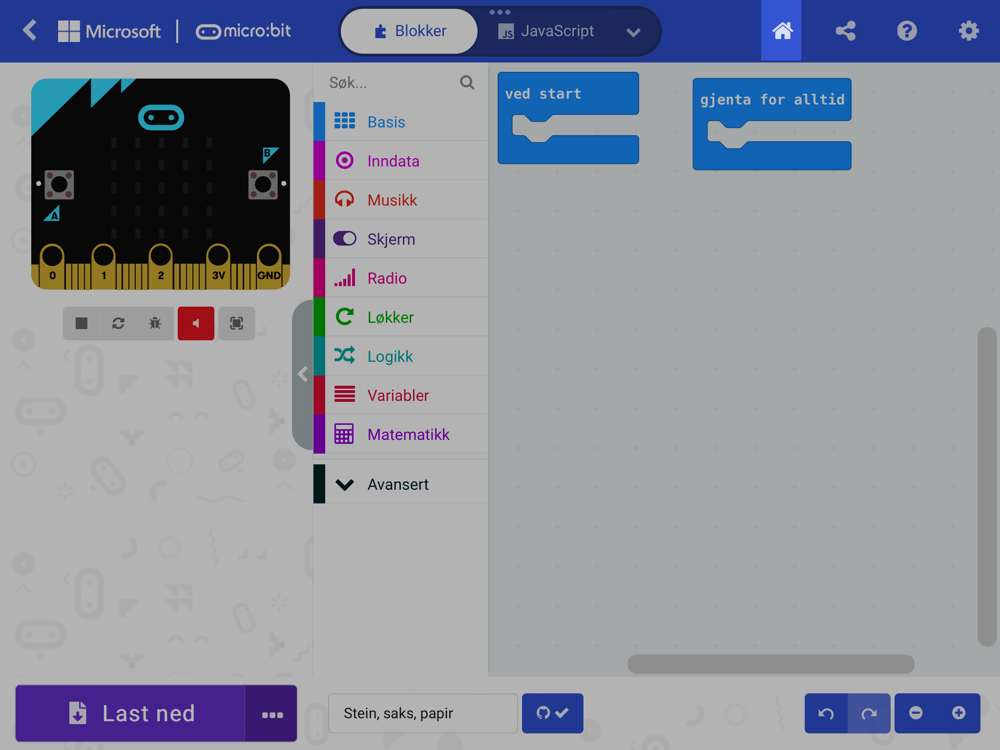
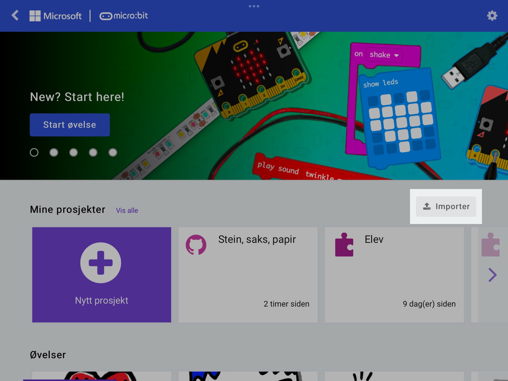
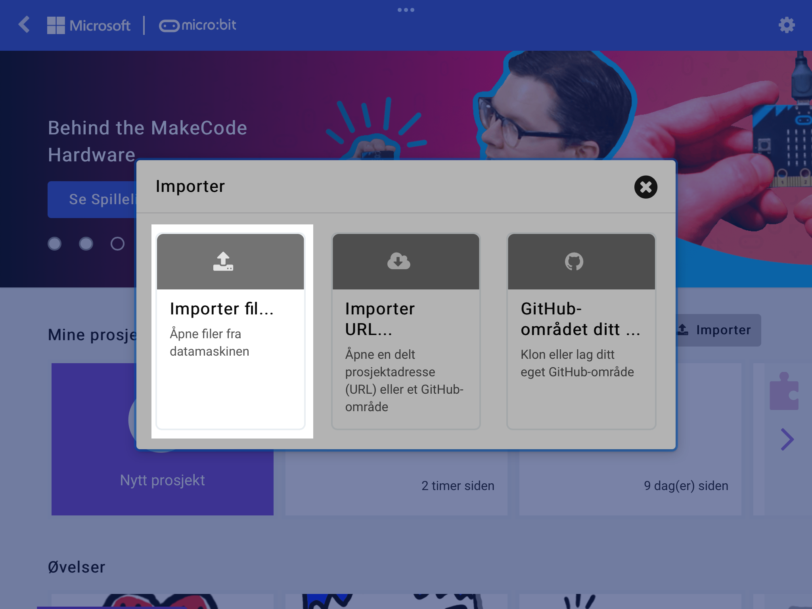
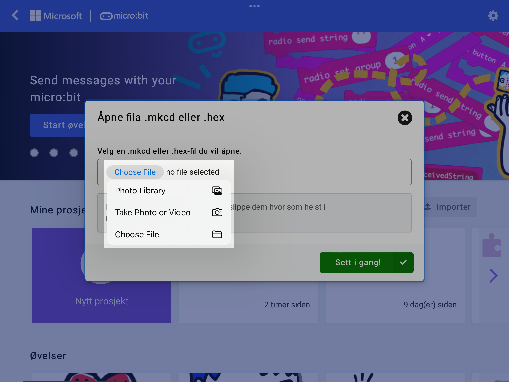
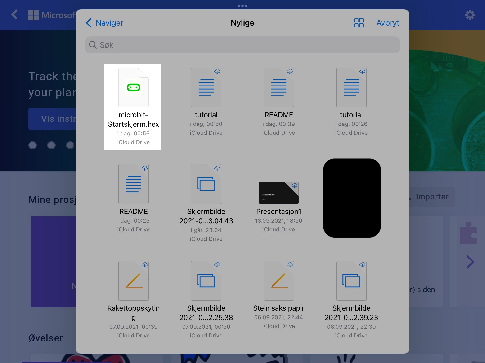

# Fra Safari til micro:bit
Slik overfører du kodingen din fra Safari til micro:bit-appen, og videre til en micro:bit.

## Steg 1
Trykk på ``Last ned`` nede i venstre hjørne.

## Steg 2
Du får opp en grå boks. Trykk på den nye ``Last ned``-knappen, og deretter den lilla ``Fullført``-knappen.

## Steg 3
Åpne micro:bit-appen, og gå inn på ``Create Code``.

### Steg 3.1
Hvis du kommer rett inn på kode-siden, så trykk på det lille huset på den øverste linja.

## Steg 4
Trykk på ``Importer``.

## Steg 5
Velg ``Importer fil``

## Steg 6
Trykk på ``Choose file`` eller ``Velg fil``. På menyen som kommer opp trykker du på den nederste. Det er litt forskjellig hva det pleier å stå, men vanligvis en av disse:
- ``Browse``
- ``Naviger``
- ``Choose file``

## Steg 7
Velg den første filen som kommer opp. Det er en ``HEX``-fil. Når du har valgt den kan du trykke på den grønne knappen som sier ``Sett i gang!``.

